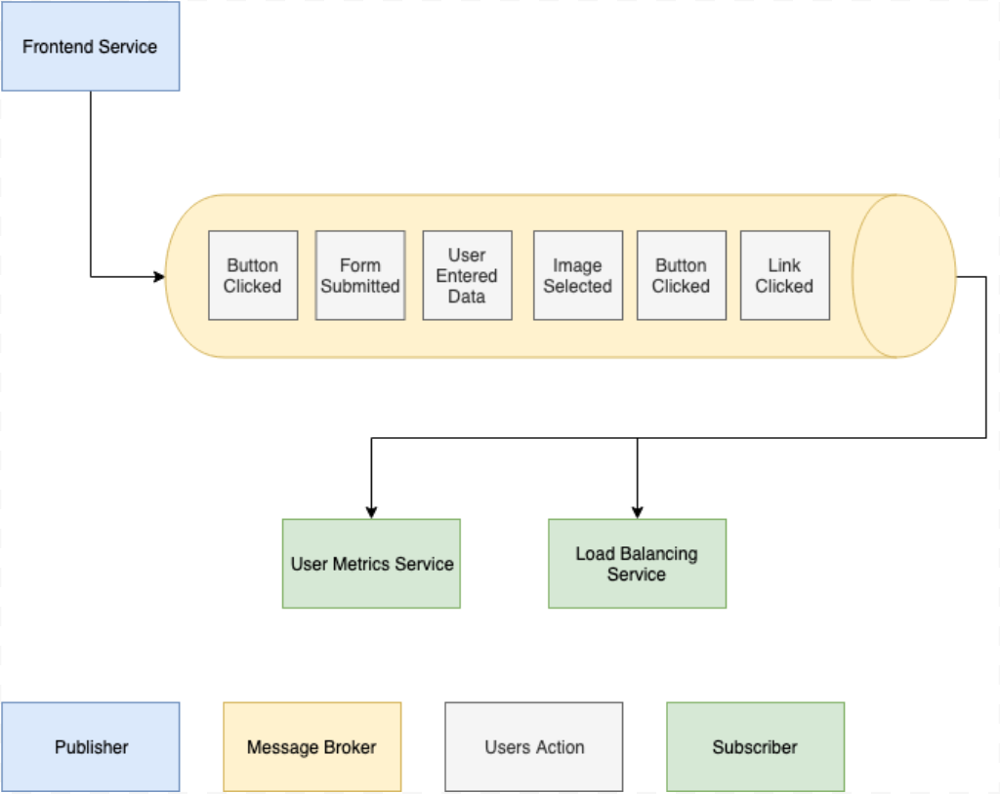

> [!IMPORTANT]
> This article was originally posted on [passion-to-profession.com](https://web.archive.org/web/20220809161453/https://passion-to-profession.com/2019/08/27/cq-shop-events-and-anomaly-detection/)

> [!NOTE]
> The code of the CQ-Shop project is available in the [cq-shop repository](https://github.com/mateuszbrycki/cq-shop).

# CQ-Shop – Events and Anomaly Detection
*Publication date:* 27/08/2019

CQ-Shop is an application written in event-driven architecture. In this post, I describe what the communication between microservices looks like. Before digging into that concept, I introduce the publish/subscription messaging. Once you get this idea, the whole concept of architecture should be clear. Moreover, I describe how I used events as a data for anomaly detection.

This is a third post from the series about the project written as my master thesis – CQ-Shop. The previous posts you may find below:
1. [CQ-Shop – Introducing the Project](./20181010-cq-shop-introducing-the-project.md)
1. [CQ-Shop – Event Storming](./20190214-cq-shop-event-storming.md)

## Publish/subscribe messaging
The publish/subscription messaging model consists of four main elements:

* message – a small portion of data
* publisher – an application that prepares and publishes the message
* subscriber – an application that has subscribed for receiving a given type of messages
* message broker – an application that is responsible for taking messages from the publisher and passing them to all the subscribers.

As an example, let’s consider the system that tracks the user’s actions. The frontend application publishes action related messages to the message broker. Two applications have subscribed that types of messages – User Metrics Service and Load Balancing Service. Once the user clicks a button, the frontend application publishes a message. The message broker passes the message to all the subscribers. Every application can be both subscriber or publisher at the same time. The number of receivers is not limited, so the broker may pass the message to more than one receiver.

## Event-driven architecture
Event-driven architecture relays on the publisher/subscriber model. However, there are events instead of messages. The event is a small portion of data, which represents something that has **happened in the system**, eg. UserAccountCreated, PasswordChanged. It should have its own, unique name, structure, and metadata. When an application wants to communicate something, then it publishes an event. Every other service interested in the given fact subscribes to a certain type of events.

There are many advantages of event-driven architecture. First of all, it **is effortless to scale**. All the communication is asynchronous, so the publisher does not have to wait for a response. The broker takes care of all the load balancing work. Moreover, **there are no strong dependencies between applications**. The communication relays on small events that are not frequently changing their structure.

Unfortunately, event-driven architecture has some disadvantages. It is hard to investigate errors due to **loosely coupled communication**. Every developer should pay much attention to logging essential data or developing a system that helps with analyzing incidents. The other disadvantage is asynchronous communication. Some systems cannot rely on such a communication model and require the response to be back within milliseconds.

## Events in CQ-Shop
There are two types of events in the CQ-Shop application: commands and domain events.

All the events are transported by a message broker named Kafka.

### Application commands
Application commands are the type of events that represents requests incoming to a service, i.e., RegisterUser, ChangePassword. The visibility of commands is minimal – **only one application has access to a given type of events**. Microservices use it for internal communication purposes. For the logging, every service publishes all the commands to the **application-command-topic**.

### Domain events
The type of events used for communication between microservices. Domain events are generally known, and **all the applications have access** to them. Domain events represent facts that are important for the system – OrderCreated, UserAccountCreated, PasswordChanged. Every microservice has separate events topic.

## Anomaly detection
At some point in analyzing the event-driven architecture, I realized that events might be a great source of knowledge about the system’s health. I decided to try to use Machine Learning techniques to analyze some of the anomalies that might happen in a regular e-commerce application.

Firstly I simulated four scenarios that caused some problems within the system. Secondly, I collected all the events published to Kafka and then analyzed them.

The first scenario was related to **exhausting product state in the warehouse**. In this simulation, the user tried to add many products to his cart. This anomaly was reasonably easy to detect, and the Decision Trees algorithm solved the problem.

The second scenario assumed that the **user tried to take advantage of the wrong product’s price**. In this case, again, the Decision Trees algorithm was capable of spotting the anomaly.

The third anomaly was related to **more or less intense system usage**. I wanted to find the time when the number of published events was extremally low or high. The One-Class SVM detected this particular anomaly. As an input, I used time-series data.

The last and most sophisticated anomaly was related to **daily workload characteristics**. I assumed that users generate the most significant traffic between 6 PM – 11 PM. It should get smaller between 11 PM and 6 AM. I tried to spot situations when one of the services stopped working, and the traffic seemed to be smaller – it meant fewer events were published. The second idea was to detect the opposite situation. If the system generated more events, it may mean that there was higher demand.

To detect the described anomaly, I feed the LSTM network with data from 22 days long simulation. I taught the model what the proper workload looks like, and asked the network to predict traffic for the next two days. I then compared the generated values with the values from days where the anomalies occurred. When there was a big difference between prediction and the actual value, then it meant that the anomaly appeared. The developed model successfully found all the anomalies.

## Summary
In this post, I described the basics of the publisher/subscriber model, then moved to event-driven architecture and introduced the communication model in the CQ-Shop application. I also showed that events from your application might be meaningful data for detecting any anomalies that occur in your system.