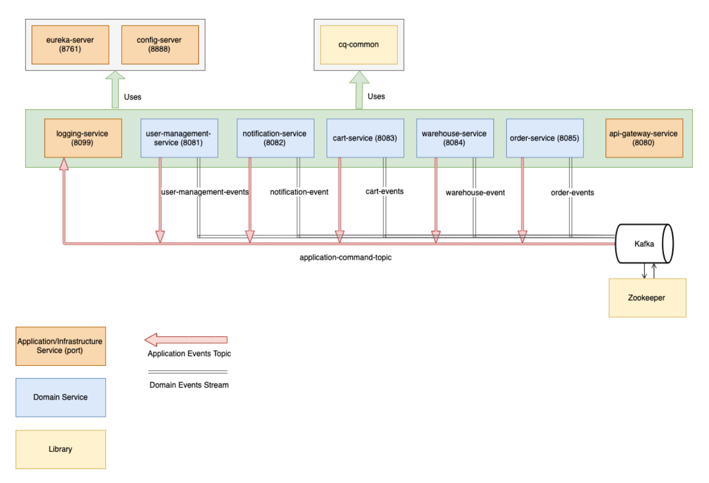

> [!IMPORTANT]
> This article was originally posted on [passion-to-profession.com](https://web.archive.org/web/20220809173539/https://passion-to-profession.com/2019/09/05/cq-shop-architecture-environment-and-tools/)

> [!NOTE]
> The code of the CQ-Shop project is available in the [cq-shop repository](https://github.com/mateuszbrycki/cq-shop).

# CQ-Shop – Architecture, Environment, and Tools
*Publication date:* 05/09/2019

From the very beginning, the CQ-Shop project was meant to be a big mix of buzzwords – microservices, event-driven, AI, and many many more. Even though the final application is a bit different than the planned one, it is still pretty impressive. In this post, I describe the architecture, development environment, and tools that I used.

## Event Storming

I started the development with the series of Event Storming workshops. They helped me to understand the business problem better. One of the outcomes of these workshops was a draft of dependencies and initial communication structure.

It was the first time when I prepared an analysis before I started the actual development. Surprisingly, I enjoyed it very much. I don’t find that time as wasted. It helped me a lot in the next stages.

[Here you can read more about Event Storming.](./20190214-cq-shop-event-storming.md)

## Application Architecture
I developed the CQ-Shop application as a microservice system which utilizes the **event-driven architecture**.

The final system consists of 9 small applications. Four of them are strictly related to infrastructure – *logging-service, api-gateway-service, config-service, eureka-service*. The other five are the services that implement the domain tasks – *user-management-service, notification-service, cart-service, warehouse-service, order-service*.

All of them are Spring Boot services developed in Java. Every application has a dedicated H2 in-memory database instance. As you can see in the diagram below, the schema consists of four smaller schemas.

## Kafka
I always wanted to learn some basics of Kafka. It was an ideal time to do so. I decided to use Kafka as the message broker that handles all the generated events. It is responsible for managing the whole communication that the CQ-Shop application generates. I used all the events transported by the message broker as data for anomaly detection.

There are six application groups – 1 group per service. There are also six topics – 5 of them are domain topics, and the other one handles application commands.

[Here you can read more about events in CQ-Shop.](./20190827-cq-shop–events-anomaly-detection.md)

## Development Environment
The whole infrastructure consists of two more services – Schema Registry and Zookeeper. It adds up to **12 concurrently running applications**. It is way too much for a single laptop with 8GBs of RAM. Not to mention at least one instance of IntelliJ IDEA.

I decided to move some of the applications into Virtual Machines on Google Cloud. To avoid latency related to the slow startup, I have selected only rarely redeployed applications.

I was able to work faster after I moved some part of the infrastructure into the cloud. The local machine was no longer overloaded.

## Machine Learning
The whole idea behind my master thesis was to detect anomalies in event-driven architecture. I planned to use TensorFlow for implementing the ML algorithms. I ended up using standard Python libraries – *NumPy, Pandas, scikit-learn*. The only new library was Renom. It provided me abstraction over LSTM Network implementation.

I used Jupyter Notebooks for developing and running the scripts. I prefer it to PyCharm or any other Python IDE.

[Here you can read more about events anomaly detection.](./20190827-cq-shop–events-anomaly-detection.md)

## Summary
As you can see, there were plenty of technologies, solutions, tools, and buzzwords used. Developing such an application solo was an excellent opportunity to learn new things. I was able to face issues that I have never spotted. **In the next post, you will find a summary of challenges, learnings, and plans.**