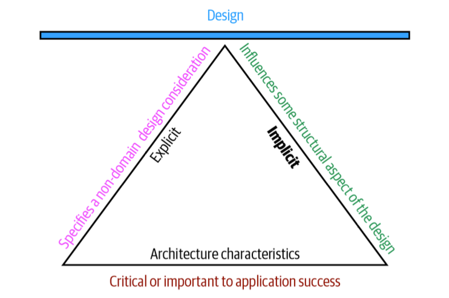

# Fundamentals of Software Architecture - An Engineering Approach

**Authors:** Mark Richards, Neal Ford

## Notes

### About Architecture and Architects
"As a software developer, it's easy to become enamored with a particular technology or approach. But architects must always soberly assess the good, bad, and ugly of every choice, and virtually nothing in the real world offers convenient binary choices - everything is trade-off."

"Every decision an architect makes will be challanged". 
Maybe a software architect should expect to be challenged and work with these challenges. Make challenges a part of the discovery process. Forge your solutions using challenges from all the interested parties. Embrace them.

"Diagramming nad presenting architectures are two critical soft skills for architects. In a presentationn, the presenter controls how quickly an idea is unfolding, whereas the reader of a document controls that. Thus, one of the most important skills an architect can learn in their presentation tool of choice is how to manipulate time."

"Negotiation is one of the most important skills a software architect can have. Effective software architects understand the politics of the organization, have strong negotiation and facilitation skills, and can oversome disagreement when they occur to create solutions that all stakeholders agree on." 

### Software

Object-oriented software system can be measured with metrics developed by [Chidamber and Kemerer Object-oriented suite](https://en.wikipedia.org/wiki/Programming_complexity).

An architecture characteristic meets three criteria:
1. specifies a nondomain design considerations,
1. influences some structural aspect of the design,
1. is critical or important to an application success.

### Translating Domain to Architecture

Examples of translating domain concerns to architecture characteristics:
| Domain Concern | Architecture characteristics |
|------------- |------------- |
| Mergers and acquisitions | Interoperability, scalability, adaptability, extensibility |
| Time to market | Agility, testability, deployability|
| User satisfaction | Performance, availability, fault tolerance, testability, deployability, agility, security |
| Competetive advantage | Agility, testability, deployability, scalability, availability, fault tolerance|
| Time and budget | Simplicity feasibility|

> [!IMPORTANT]
> **There are no wrong answers in architecture, only expensive ones.**
> **There is no best design in architecture, only a least worst collection of trade-offs.**

### Domain vs Architecture
A test that helps to determine between domain and architecture charactaristics:
> Does it require domain knowledge to implement, or is it an abstract architecture characteristics? 

### Software Developers and Architects
Software Developers hould never take components designed by architects as the last word; all software design benefits from iteration. Refer to the architects being challanged section.

"If a developer disagrees with a decission, have them arrive at the solution on their owns."

A software architect leads by example, not by the title. Use your negotation, presentation, leadership skills to onboard the team to your idea. Hear their voice. Let them make decissions. 

### 4 C's
1. Clarity
1. Communication
1. Consciseness
1. Collaboration

### 20-minute rule
Devote at least 20 minutes a day to your career as an architect by learning something new or diving deeper into a specific topic. Plan these 20 minutes as the first 20 minutes of your working day.

### Personal Technology Radar
When using the radar for personal use, alter meanings of the quadrants:
1. Hold - technologies and techniques to avoid, habits to break,
1. Assess - promising technologies that you have heard good things about but haven't had time to assess for yourself,
1. Trial - active research and development (spike experiments with larger codebase),
1. Adopt - new things you're excited about and best practices for solving particular problems.

You should choose some technologies and/or skills that are widely in demand and track that demand. 