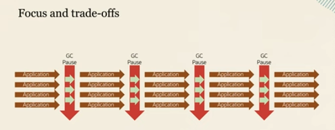
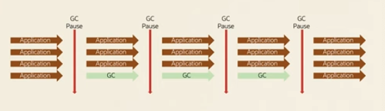

# Garbage Collectors

Automatic memory management:
1. fast allocation (thread local allocation buffers),
1. efficient reclamation.

Fast allocation is more or less the same in all the GCs.
The thing that differs is the reclamation part.

No single GC can solve all the problems. There are several use cases.

## Memory reclamation
1. Determine live objects - which objects we need to keep alive. Start with roots - objects on thread stacks, and static fields.
  1. GCs track the object graph.
1. Reclaiming memory
  1. free lists
  1. compaction - compacts objects into new sectors so that memory is not fragmented.
1. Stop-the-world or concurrent collection
 
Generation collections
1. Young generation - newly allocated objects
1. old generation - old objects that survived GCs

## Generation hypothesis
Objects are only used for a short period of time. A small part of the young generation will be used later.

New objects are created in Eden. Later are moved to survaviour 1. After some treshold, they are moved to Old region. 
The treshold is calculated dynamically - GC counts the object's age and calculates the optimal value.
If objects are living long, GC will move them after 15 cycles. However, if GC spots that objects don't survice 3 cycles, the treshold will be adjusted to 3. 

HTTP sessions and caches do not comply with the hypothesis - they live long. GCs have problem with such objects.

## GC Phases
1. Small collection - cleaning young
1. Major collection - cleaning old
1. Full collection - cleaning everything
1. Stop the world (STW) - stopping the application

## Choosing your GC
1. Main focus for the application
  1. Throughput - the raw number of transactions in a set amount of time
  1. Latency
  1. Footprint - overhead caused by the GC

| Collector name | Focus Area |
|------------- |------------- |
| Serial | Memory footprint |
| Parallel | Throughput|
| G1 | Balanced Performance |
| ZGC | Low latency|
| Shenandoah | Low Latency|

## Serial GC
1. Low memory overhead
1. Generational collection - heap layout = young generation + old generation
1. STW and single thread

Not optimal for large heaps.
Good choice for small containers.

### Young Generation 
Copying between eden, suvariour 1/2. There is no fragmentation. It makes sense if young region is small and allocation rate is high.

### Old Generation
MarkSweepCompact:
1. mark unused objects,
1. remove unused objects,
1. compact the rest of objects to remove fragmentation.

Makes sense for 1 CPU systems.

## Parallel GC
1. Throughput oriented
1. Generational collection - heap layout = young generation + old generation
1. Multithreaded STW collections
1. Default collector up until JDK 8

## CMS - Concurrent Mark Sweep
Best fit for multiple threads. STW for minor collection.

### Young Generation 
ParNew:
1. parralel copy copllector with internal callback for old generation collector

### Old Generation 
ConcurrentMarkSweep:
1. the majority of heap processing happens in parallel to application threads,
1. it's concurrent application works along with the GC,
1. if the memory is highly occupied the STW will be more frequent,
1. Concurrent Mode Failure - in such cases CMW is stopped, the Serial GC is started.

Low-pause collector but high CPU usage.

## G1
1. Balance between throughput and latency
1. Region-based heap layout - the heap is divided into smaller zones. Each region is either a young or old generation
1. Determines the liveness of the objects concurrently (concurrent marking phase)
1. mixed collections are collections where GC collects the young generation together with a few old regions. Multiple mixed collections prevent long pauses.
1. main tuning knob: pause-time goal
1. Default collector since JDK 9

### Young Generation
G1 Young Generation

### Old Generation
1. Initial mark (STW) - szukamy wszystkie rooty (visible by definition)
    1. System class loader + classes it loaded
    1. Live Thread
    1. Monitor
    1. Local variables
1. Root Region Scanning - concurrent phase (application is running)
    1. looking for roots referencing to Old
1. Concurent Marking - concurrent phase
    1. find live objects over the entire heap
    1. phase can be interrupted by young generation GC
1. Remark - (STW)
    1. remarks all live objects, uses an algorithm called snapshot-at-the-beginning - marks all the objects that changed since the beginning of heap processing
1. Cleanup - (STW/Concurrent)

## ZGC
1. Low latency and scalable to support terabyte heaps without increasing pause time
1. Region-based
1. Fully concurrent collections, small STW pauses used for synchronization
1. uses Load barriers - a highly optimized code for threads that points to the object's actual location.
1. generational collections since JDK 21. Default since JDK 23.

## Materials
1. [Garbage Collection in Java - The progress since JDK 8](https://www.youtube.com/watch?v=L68zxvl2LPY)
1. [WJUG #167 - Garbage Collector w pigułce - Jakub Kubryński](https://www.youtube.com/watch?v=LCr3XyHdaZk)
1. [Java's Garbage Collection Explained - How It Saves your Lazy Programmer Butt](https://www.youtube.com/watch?v=Mlbyft_MFYM)