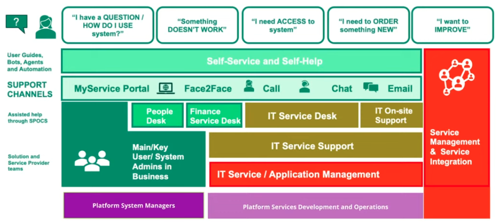

# Security in Platform Engineering

## IT vs IT Dillemma
- Modern software development vs traditional type of IT infrastructure
- CTO vs CIO
- Digital development vs core IT
- move fast vs secure environments

Think about organization works, how the teams are structured, how they cooperate, what are the delivery types.
If you have different processes without thinking about the end user experience or who is using your services, you lose sight of what actualy matters.

Map user journeys to understand users' world.

**A digital platform is a foundation of self-service APIs, tools, services, knowledge and support which are arranged as a compelling internal product.**
If it's not compelling, people won't use it. 

manual  -> automated
ticket  -> self-service
days    -> minutes

1. What Platform Engineering Capabilities you want to support?

1. How Should the Holistic Delivery Model Work?

1. How Platform Engineering CHanged How We Think About Cyber Security (and vice-versa)?

At the bottom there are built-in capabilities. There are two distinct areas that need to interfere with each other.
The left side is about governance - compliance, risk management, awerness, security policies. 
The right side is about operations.
Each of these five different platform engineering capabilities are interacting with different cybersecurity teams. 
They key to managing this split was to understand how the different teams are interacting with one another and how different platform engineering teams are really thinking about cybersecurity. They wanted to have cybersecurity platforms squad as its own element to be able to quickly react to chaning environment. 

**Who are you serving as a platform team?** Understand who and how uses the platform. 
They realized that they had two different providers for the same platform capability - one supplier was providing B&DR tooling in environment A, second supplier did the same for environment B. They realized there were more synergies to be held if the things start to be more holistic.

There are subdomains in platform cybersecurity:
1. governance,
1. security engineering,
1. security operations...
Understand how they relate with each other. Invest in estabilshing Cyber Security Platforms.
All the platform engineering teams should share security mindset. 

## Q&A 
### Skills in Platform Engineering Security Squad
In the cybersecurity platform squad they have engineers. They need to have strong security mindset. They need to understand regulations that the company applies to. They also have compliance teams that build the bridge between regulations and engineering. 

### Establishing lines of responsibility between security teams
Each squad has its own domain areas 
- cybesecurity squad looks at the tooling for SOC analysts, 
- platform engineering squad looks at the infrastructure and environments.

You need to understand the different responsibilities of cybersecurity teams. SOC is not doing engineering. They might be the main customer of the cybersecurity platform squad. You have people looking at governance and tactival of cybersecurity. You also have people looking at the cybersecurity engineering. And you also have people looking at the cybersecurity operative work. 

### Processes
When looking at how the platform teams are working, you need to create playbooks that are common operations for all the platform squads. 
There are also some IT processes that are common across all the industries - incident management, change management, etc.

## Materials
1. [Platform engineering security: Strategies, challenges, and lessons learned](https://www.youtube.com/watch?v=5a6j_VJJQcI)
1. [What I Talk About When I Talk About Platforms](https://martinfowler.com/articles/talk-about-platforms.html)